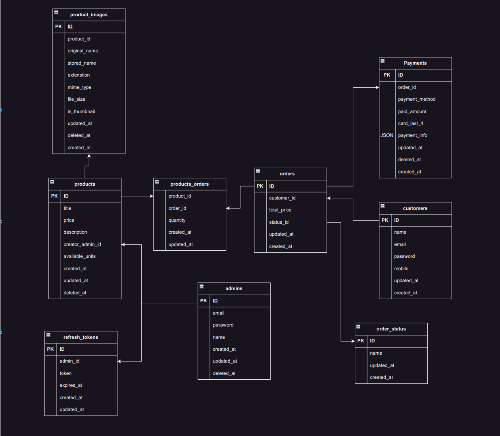
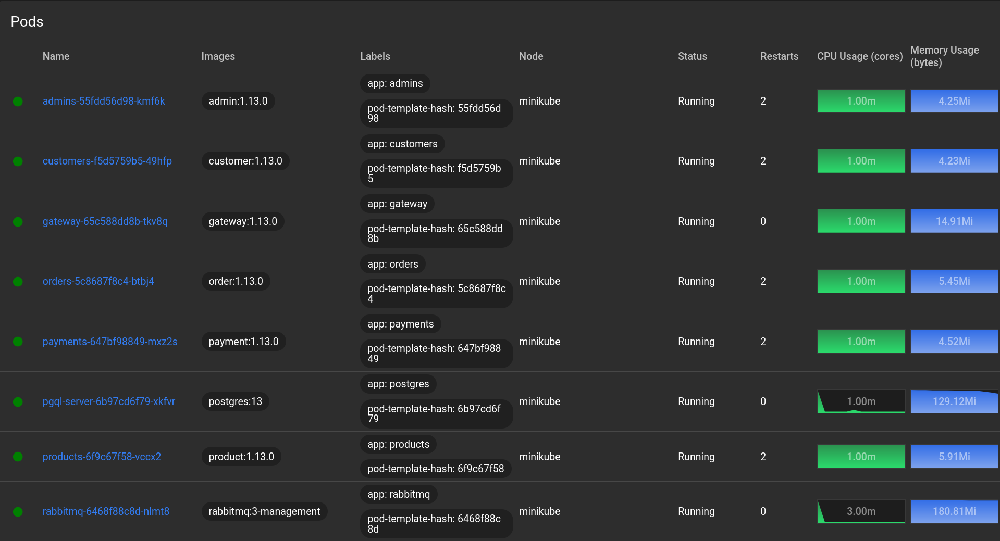
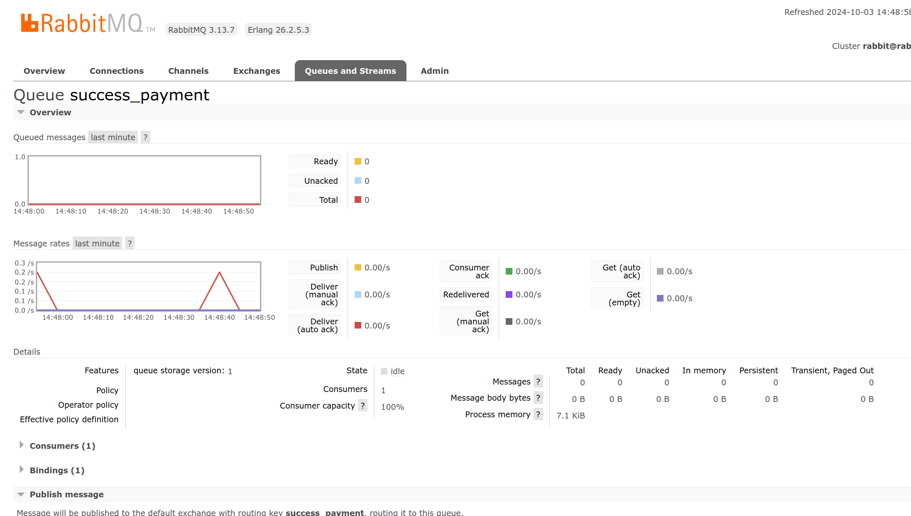
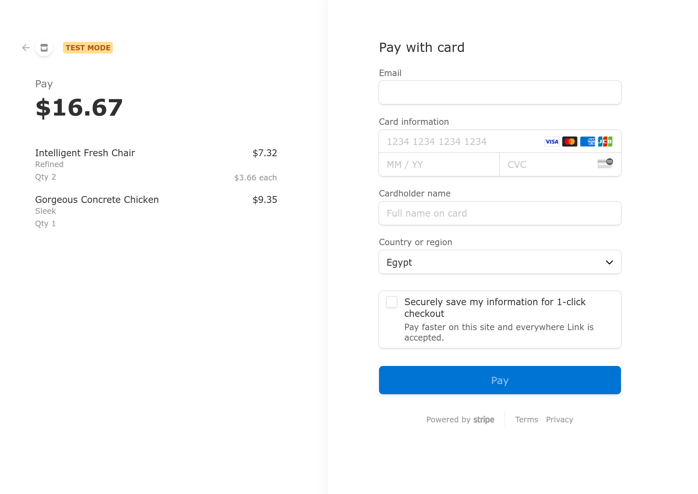

# Golang E-Commerce Microservices ⚡️

## Features

- **Product**
  - Create
  - Update
  - List
  - Show
  - Delete
- **Customer**
  - Register
  - login
  - Refresh Auth Token
  - Update Info
  - View Profile
- **Admin**
  - Create Admin _(CLI command)_
  - Update Info
  - Login
  - Refresh Auth Token
- **Order**
  - Create Order
  - View Order Details
- **Payment**
  - Pay Order
  - Get Payment Operation Information
  - Handle Success/Fail redirect from Stripe payment gateway
- **RabbitMQ**
  - Publish Event when Success Payment Operation is done
  - Consume it from orders microservice
- **Postman** Collection found [here](/docs/postman-collection-v1.json)
- **ERD** 

## List of what has been used

- [gRPC](https://grpc.io/)
- [Proto](https://protobuf.dev/) - Protocol Buffers
- [Docker](https://www.docker.com/) - Docker
- [K8S](https://kubernetes.io/) - Kubernetes :
- [HELM](https://helm.sh/) - The package manager for Kubernetes
- [RabbitMQ](https://www.rabbitmq.com/) - RabbitMQ message broker :
- [gRPC Gateway](https://github.com/grpc-ecosystem/grpc-gateway) - gRPC to JSON proxy generator following the gRPC HTTP spec
- [Stripe](https://stripe.com/) - Integration with Stripe payment gateway 
- [JWT](https://github.com/golang-jwt/jwt) - JSON Web Tokens for authentication
- [Gorm](https://gorm.io/) - ORM library for GoLang
- [migrate](https://github.com/golang-migrate/migrate) - Database migrations. CLI and Golang library.
- [Scheduler](github.com/robfig/cron) - Running periodic tasks
- [Swagger](https://swagger.io/) - Swagger API Specs
- [Slack](https://slack.com/) - Sending Logs to slack channel
- [Slog](https://pkg.go.dev/log/slog) - Structured logging in products microservice
- [Cobra](https://github.com/spf13/cobra) - Cobra for handling CLI commands (serve, migrate, ...)

### Quick Start On Local Environment

> Using Minikube, Helm and docker

1. git clone `https://github.com/ahmedmohamed24/ecommerce-microservices.git`
2. `cd ecommerce-microservices/`
3. `make minikube-k8s version=1.0.0`
